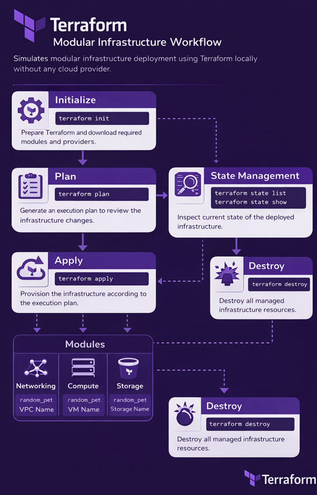

# 🚀 Terraform Modular Demo Project

## 📌 Overview

This project demonstrates a **modular Terraform architecture** without using any cloud provider.

It focuses on understanding:

- Terraform modules
- Providers
- State management
- Outputs
- Root module structure
- Resource lifecycle

This is a learning/demo project before moving to real cloud infrastructure (AWS/Azure/GCP).

---

## 🏗 Terraform Workflow Architecture

This diagram represents the modular Terraform workflow used in this project.


### 🔍 Workflow Explanation

1. **Initialize** – Downloads providers and modules.
2. **Plan** – Generates execution plan.
3. **Apply** – Provisions infrastructure.
4. **State Management** – Tracks resource state.
5. **Destroy** – Removes managed infrastructure.
6. **Modules** – Networking, Compute, Storage are isolated logical components.

## 📂 Project Structure

```
terraform-devops-project/
│
├── main.tf
├── .terraform.lock.hcl
├── terraform.tfstate
│
└── modules/
    ├── networking/
    │   └── main.tf
    ├── compute/
    │   └── main.tf
    └── storage/
        └── main.tf
```

---

## 🧠 What This Project Does

Each module creates a `random_pet` resource:

- Networking → VPC name simulation
- Compute → VM name simulation
- Storage → Storage name simulation

Root module collects outputs from each module.

---

## ⚙️ Commands Used

### Initialize Terraform
```bash
terraform init
```

### Plan Infrastructure
```bash
terraform plan
```

### Apply Infrastructure
```bash
terraform apply
```

### Check Terraform State
```bash
terraform state list
terraform state show module.compute.random_pet.vm_name
```

### Destroy Infrastructure
```bash
terraform destroy
```

---

## 🎯 Learning Outcomes

✔ Understanding modular Terraform design  
✔ Root module vs child modules  
✔ How outputs work  
✔ How Terraform state works  
✔ Resource lifecycle (create / replace / destroy)  

---

## 🚀 Next Steps

- Add variables
- Add environments (dev/stage/prod)
- Move to real AWS infrastructure
- Implement remote backend

---

## 👩‍💻 Author

Tanavi – Learning DevOps & Infrastructure as Code 🚀